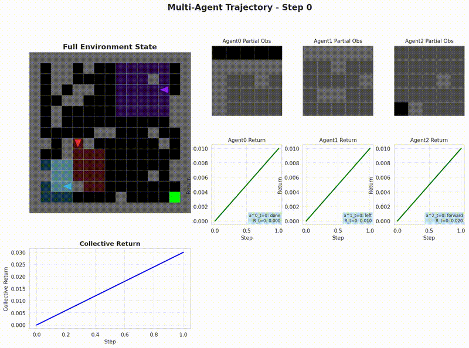

# Multi-Agent PPO for MultiGrid Environments

Multi-agent Reinforcement Learning implementation based on the [MultiGrid](https://github.com/maximecb/gym-minigrid) framework.

<div align="center">
  
  <p><em>Multi-agent cooperation in MultiGrid environment</em></p>
</div>

## 🚀 Key Features

- **Smart Reward Shaping**: Goal-oriented reward functions for sparse reward environments  
- **Behavior Monitoring**: Real-time agent activity analysis and adaptive training
- **Trajectory Visualization**: Comprehensive video generation with environment and agent states

## 🛠️ Quick Start

### Installation
```bash
pip install -r requirements.txt
```

### Training
```bash
# Recommended stable version
python v8_robust_ppo.py --env MultiGrid-Cluttered-Fixed-15x15 --episodes 100000

# With WandB logging
python v8_robust_ppo.py --project your-project --name experiment-1
```

### Generate Videos
```bash
python generate_trajectory_video.py --model-path models8/best_performance --env MultiGrid-Cluttered-Fixed-15x15
```
